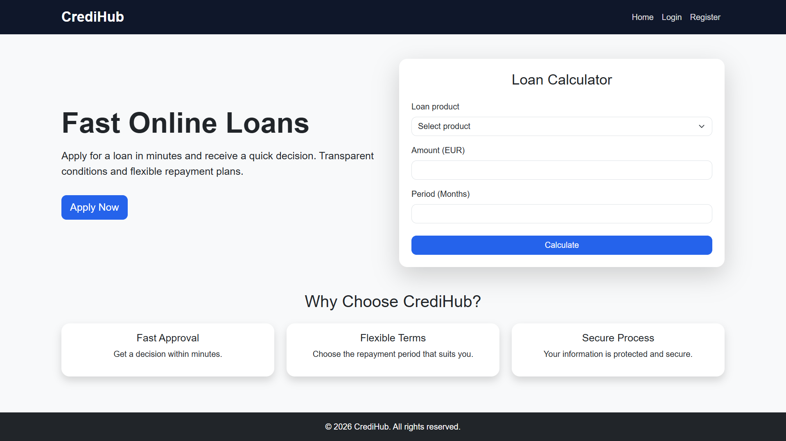
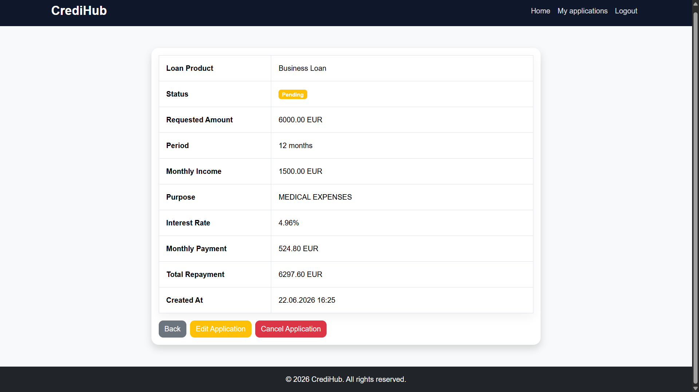
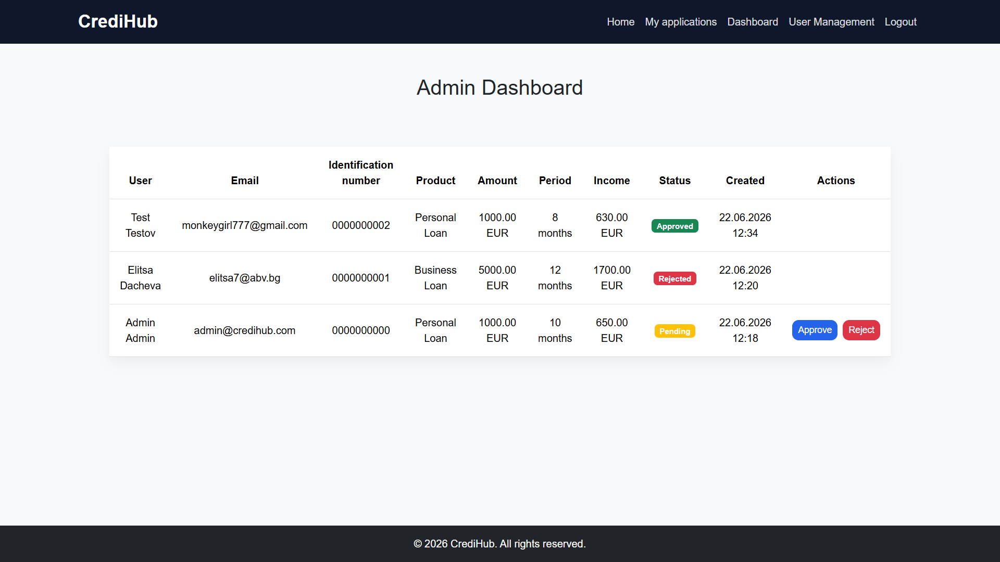
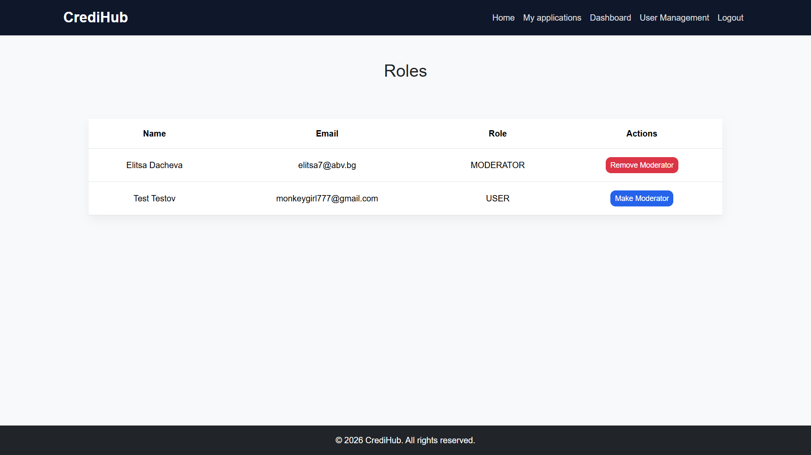

# CrediHub

CrediHub is a web-based loan management platform built with Spring Boot. The application allows users to apply for loans, calculate loan costs, edit or cancel pending applications, track their application status, and manage their loan requests. Administrators and moderators can review and process applications through a dedicated administration panel.

## Features

### Authentication

* User registration
* User login and logout
* Session-based authentication
* Role-based authorization

### Loan Applications

* Create loan applications
* View personal applications
* View application details
* Edit pending applications
* Cancel pending applications
* Loan calculator

### Administration

* View all submitted applications
* Approve applications
* Reject applications
* Dashboard for application management

### Main Functionalities
1. Create Loan Application
2. Update Pending Loan Application
3. Cancel Loan Application
4. Approve Loan Application
5. Reject Loan Application

### User Roles

#### USER

* Create loan applications
* View own applications
* Edit own pending applications
* Cancel own pending applications

#### MODERATOR

* View all applications
* Approve applications
* Reject applications

#### ADMIN

* Full moderator permissions
* Manage user roles
* Promote users to moderators
* Remove moderator privileges

## Screenshots

### Home Page



### Application Details



### Admin Dashboard



### User Management



## Loan Products

### Personal Loan

* Amount range: 100 EUR – 10,000 EUR
* Repayment period: 2 – 60 months

### Business Loan

* Amount range: 5,000 EUR – 100,000 EUR
* Repayment period: 12 – 120 months

## Loan Calculator

The application includes a loan calculator that allows users to estimate loan costs before applying.

After selecting a loan product, entering the desired amount and repayment period, and clicking the **Calculate** button, the system calculates:

* Interest rate
* Monthly payment
* Total repayment amount

The calculation is based on the selected loan product and its configured interest rates.

## Database Relationships

### User → LoanApplication

**Relationship:** One-to-Many

A user can have multiple loan applications.

### LoanProduct → LoanApplication

**Relationship:** One-to-Many

A loan product can be associated with multiple loan applications.

### LoanApplication → LoanDecision

**Relationship:** One-to-Many

A loan application can have multiple decisions.

### User → LoanDecision

**Relationship:** One-to-Many

An administrator or moderator can create multiple loan decisions.

## Technologies

* Java 17
* Spring Boot
* Spring MVC
* Spring Data JPA
* Hibernate
* Thymeleaf
* MySQL
* Bootstrap 5
* Maven

## Configuration

Before running the application, configure the following properties in `application.properties`:

```properties
spring.datasource.username=
spring.datasource.password=
app.admin.password=Admin123!
```
Default administrator account:

```text
Email: admin@credihub.com
Password: Admin123!
```

The database is created automatically when the application starts if it does not already exist.

## Running the Application

1. Configure the database credentials.
2. Run the Spring Boot application.
3. Open:

```text
http://localhost:8080
```

## Future Improvements

* Online loan payments
* Email notifications
* Credit score evaluation
* Document uploads
* Application search and filtering
* Reporting and analytics
