# 🚀 CrediHub

### Full-Stack Loan Management Platform

CrediHub is a full-stack digital loan management platform built with **Java 17**, **Spring Boot**, **Spring Security**, **Spring Data JPA**, **Thymeleaf**, **MySQL**, **Spring Cloud OpenFeign**, **Stripe**, and **Microsoft Azure**.

The platform covers the complete loan lifecycle — from loan calculation and application submission to application review, loan creation, repayment scheduling, and installment payments.

[](https://www.oracle.com/java/)

[](https://spring.io/projects/spring-boot)

[](https://spring.io/projects/spring-security)

[](https://spring.io/projects/spring-data-jpa)

[](https://www.thymeleaf.org/)

[](https://www.mysql.com/)

[](https://getbootstrap.com/)

[](https://stripe.com/)

[](https://azure.microsoft.com/)

[](https://maven.apache.org/)

[](https://junit.org/junit5/)

[](https://github.com/features/actions)

---

## 📑 Table of Contents

- [🌍 Live Demo](#-live-demo)

- [📖 About the Project](#-about-the-project)

- [✨ Main Features](#-main-features)

- [🔐 Authentication & Authorization](#-authentication--authorization)

- [🔑 Administrator Initialization](#-administrator-initialization)

- [🔄 Loan Lifecycle](#-loan-lifecycle)

- [💳 Payment Service](#-payment-service)

- [🧪 Testing](#-testing)

- [📸 Screenshots](#-screenshots)

- [⚙️ Local Setup](#-local-setup)

- [💳 Local Payment Testing](#-local-payment-testing)

- [💳 Stripe Test Cards](#-stripe-test-cards)

- [☁️ Azure Deployment](#-azure-deployment)

- [📡 Payment Service API](#-payment-service-api)

- [🔮 Future Improvements](#-future-improvements)

- [🔗 Related Project](#-related-project)

- [👩‍💻 Author](#-author)

---

# 🌍 Live Demo

The application is deployed and ready to use:

**Live Demo:**  

https://credihub-dhcmagcdhpb8dca7.uaenorth-01.azurewebsites.net/

No Stripe account or Stripe configuration is required from the evaluator.

The live environment is already configured with the application, database, Payment Service, and Stripe settings.

### Administrator account

```text

Email:

admin@credihub.com

Password:

Admin123!

```

The demo administrator credentials are provided for evaluation purposes.  

The password is not stored in the source code.

---

# 📖 About the Project

CrediHub simulates a digital lending platform where users can:

- Register and authenticate

- Manage their profile

- Calculate loan repayments

- Submit loan applications

- Track application status

- View approved loans

- View rejected loans

- View repayment schedules

- Pay installments

- Track their remaining loan balance

The application also provides role-based administration for:

- Reviewing applications

- Approving and rejecting applications

- Managing users and moderator roles

- Managing loan products

Payment functionality is separated into a dedicated **Payment Service microservice**.

___

# 🔗 Related Project

### CrediHub Payment Service

https://github.com/elitsa7/credihub-payment-service


---

# ✨ Main Features

## 👤 Guest Users

Unauthenticated visitors can:

- View the home page

- Use the loan calculator

- Register

- Login

## 👥 Registered Users

Authenticated users can:

- View and edit their profile

- Submit loan applications

- Edit pending applications

- Cancel pending applications

- View applications and application details

- View approved loans

- View rejected loans

- View repayment schedules

- Track installment statuses

- Pay the next available installment

- Track remaining loan balance

## 🛡️ Moderator

Moderators can:

- View submitted applications

- Review application details

- Approve pending applications

- Reject pending applications

## 👑 Administrator

Administrators can:

- Review applications

- Approve and reject applications

- Manage users

- Promote users to Moderator

- Remove Moderator roles

- Edit loan products

- Activate and deactivate loan products

---

# 🔐 Authentication & Authorization

CrediHub uses **Spring Security** with role-based authorization.

Supported roles:

```text

USER

 └── Customer functionality

MODERATOR

 ├── Customer functionality

 └── Application review

ADMIN

 ├── Customer functionality

 ├── Application review

 ├── User management

 └── Loan product management

```

Passwords are encoded using Spring Security's password encoder.

---

# 🔑 Administrator Initialization

A default administrator is initialized when the application starts if the configured administrator does not already exist.

Administrator email:

```text

admin@credihub.com

```

The administrator password is configured using:

```text

ADMIN_PASSWORD

```

Example:

```text

ADMIN_PASSWORD=your-secure-password

```

The password is intentionally kept outside the source code.

---

# 🔄 Loan Lifecycle

```text

Register / Login

       │

       ▼

Loan Calculator

       │

       ▼

Submit Application

       │

       ▼

PENDING

       │

       ▼

Moderator / Admin Review

       │

       ├──────────────► REJECTED

       │

       ▼

APPROVED

       │

       ▼

Loan Account Created

       │

       ▼

Installments Generated

       │

       ▼

Installment Becomes Payable

       │

       ▼

Payment

       │

       ▼

Installment PAID

       │

       ▼

Remaining Balance Updated

       │

       ▼

Next Installment

       │

       ▼

All Installments Paid

       │

       ▼

Loan CLOSED

```

---

# 💳 Payment Service

CrediHub uses a dedicated **Payment Service microservice** for loan accounts, installments, payments, and Stripe integration.

Communication between the two applications is handled through **Spring Cloud OpenFeign**.

```text

CrediHub

   │

   │ OpenFeign

   ▼

Payment Service

   │

   ├── Loan Accounts

   ├── Installments

   ├── Payments

   └── Stripe Checkout

          │

          ▼

       Stripe

```

Internal communication is secured using:

```text

X-API-KEY

```

The shared key is configured through:

```text

PAYMENT_SERVICE_API_KEY

```

The Payment Service is available in a separate repository:

https://github.com/elitsa7/credihub-payment-service

### Payment Flow

```text

Loan Approved

     │

     ▼

Loan Account Created

     │

     ▼

Installments Generated

     │

     ▼

Installment Due

     │

     ▼

Stripe Checkout

     │

     ▼

Stripe Webhook

     │

     ▼

Installment PAID

     │

     ▼

Loan Balance Updated

```

The Payment Service handles:

- Loan accounts

- Installments

- Payments

- Stripe Checkout

- Stripe webhooks

- Payment state management

- Overdue installment processing

---

# 🧪 Testing

The project includes:

- Unit tests

- Controller/API tests

- Integration tests

- Security tests

Technologies used:

- JUnit 5

- Mockito

- Spring Boot Test

- MockMvc

- H2

- JaCoCo

Run tests:

```bash

mvn test

```

Generate the JaCoCo report:

```bash

mvn verify

```

---

# 📸 Screenshots

## 🏠 Home Page

<details>

<summary>📷 View Screenshot</summary>

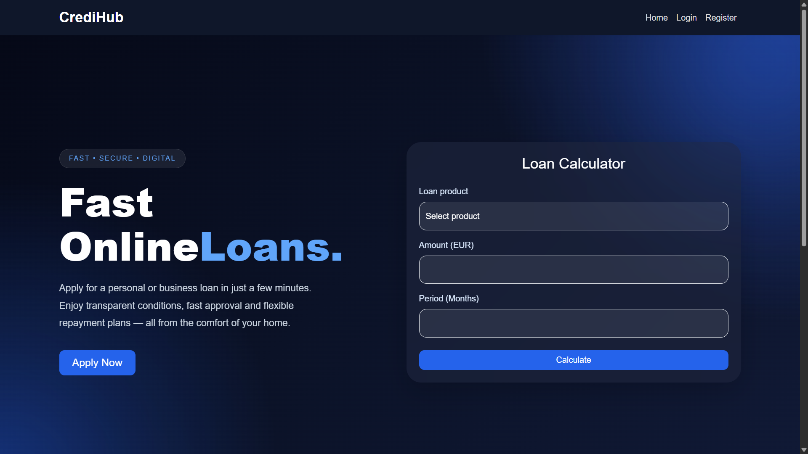


</details>

## 🧮 Loan Calculator

<details>

<summary>📷 View Screenshot</summary>

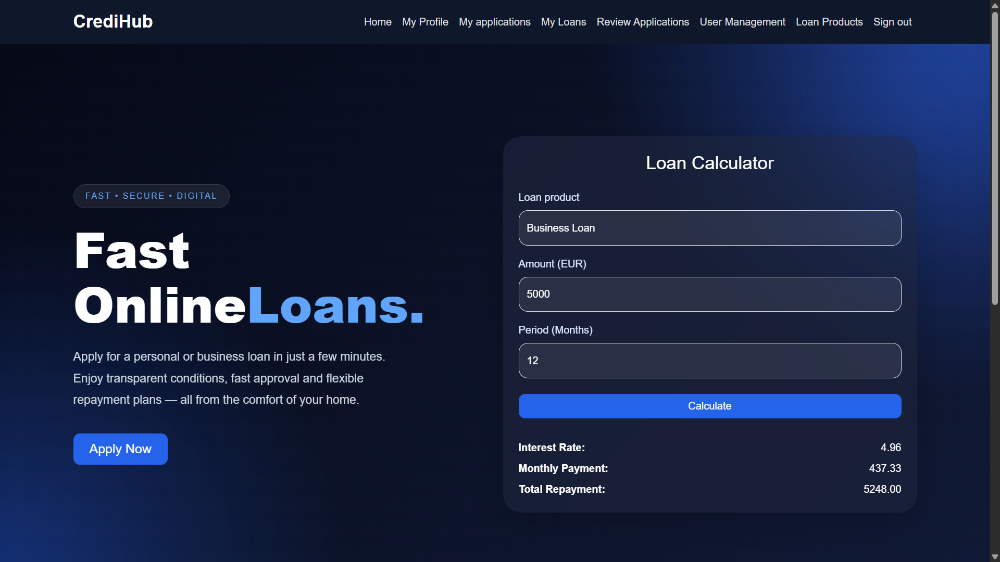

</details>

## 📝 Create Loan Application

<details>

<summary>📷 View Screenshot</summary>

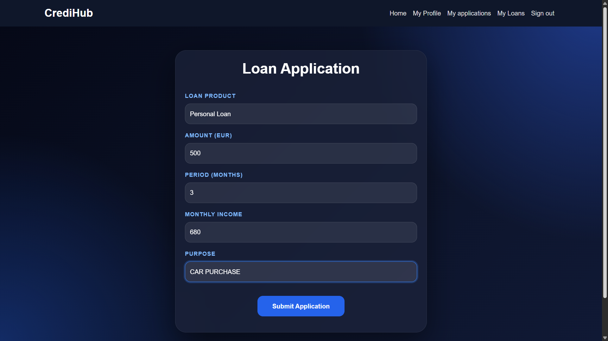

</details>

## 📋 My Applications

<details>

<summary>📷 View Screenshot</summary>

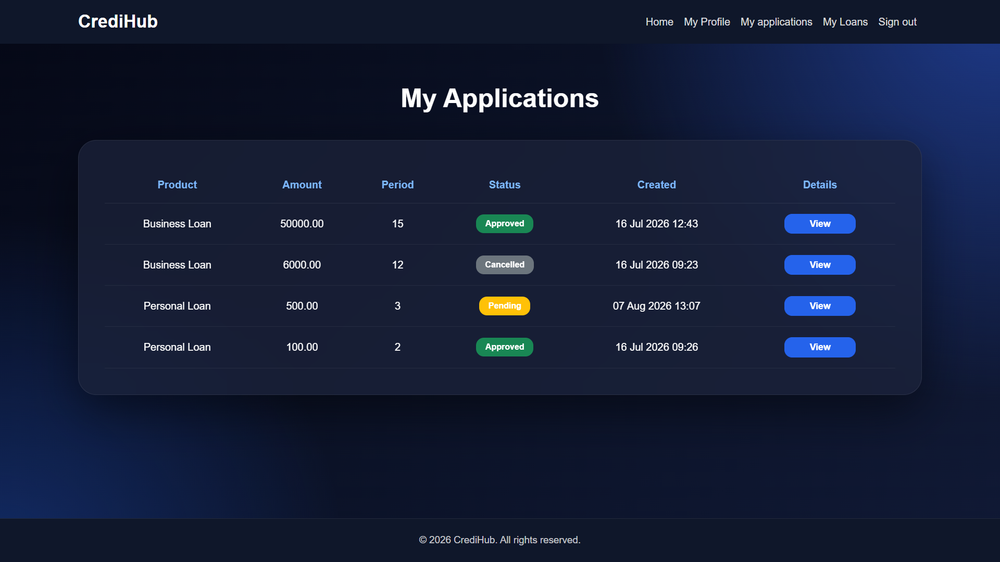

</details>

## 🔎 Application Details

<details>

<summary>📷 View Screenshot</summary>

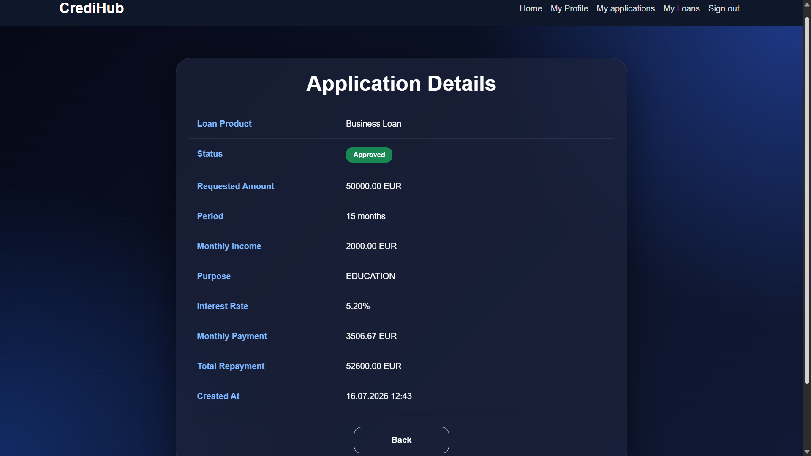

</details>

## 💰 My Loans

<details>

<summary>📷 View Screenshot</summary>

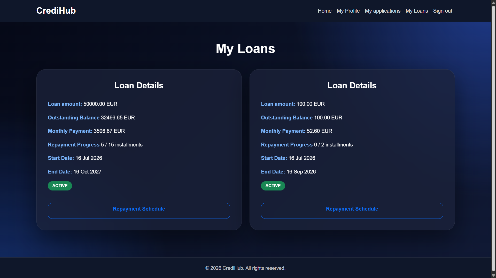

</details>

## 📅 Repayment Schedule

<details>

<summary>📷 View Screenshot</summary>

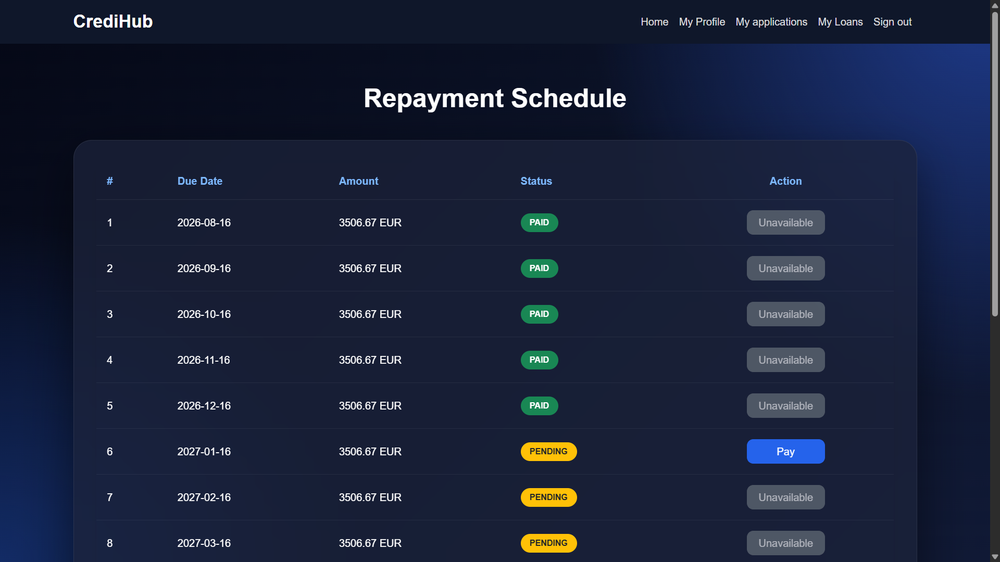

</details>

## 💳 Stripe Checkout

<details>

<summary>📷 View Screenshot</summary>

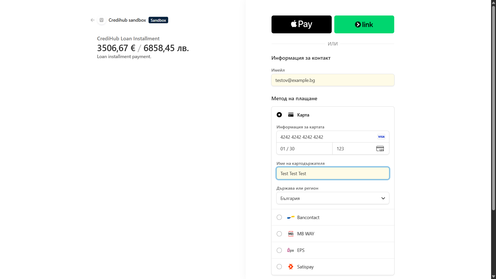

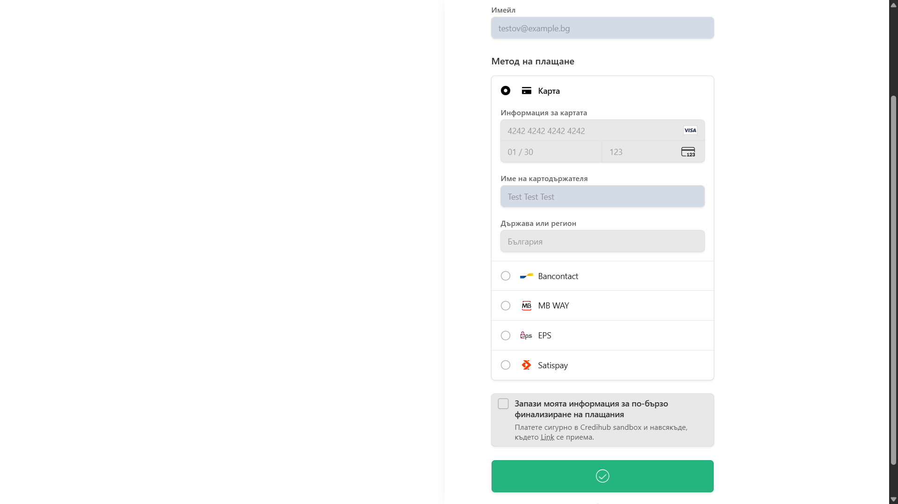

</details>

## 👑 Administration Home Page

<details>

<summary>📷 View Screenshot</summary>

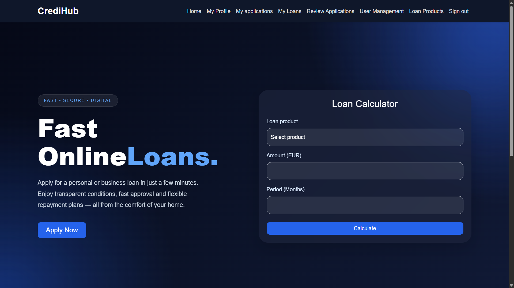

</details>

## 🛡️ Review Applications

<details>

<summary>📷 View Screenshot</summary>

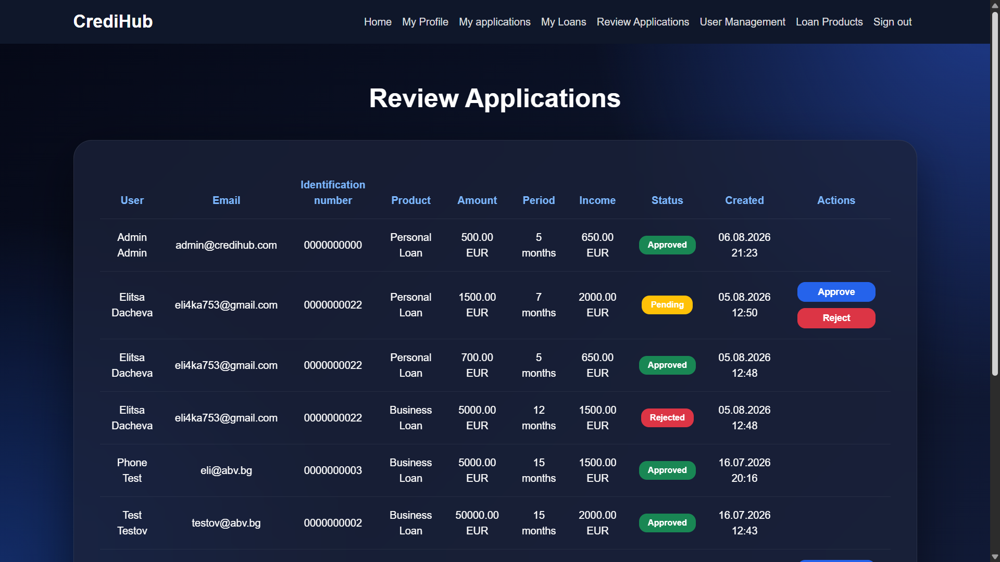

</details>

## 👥 User Management

<details>

<summary>📷 View Screenshot</summary>

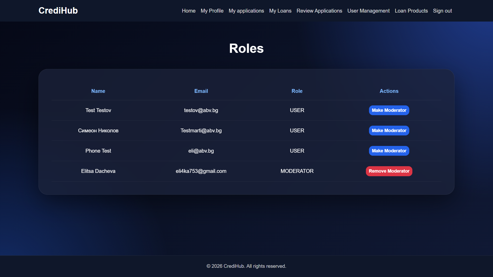

</details>

## 🏦 Loan Products

<details>

<summary>📷 View Screenshot</summary>

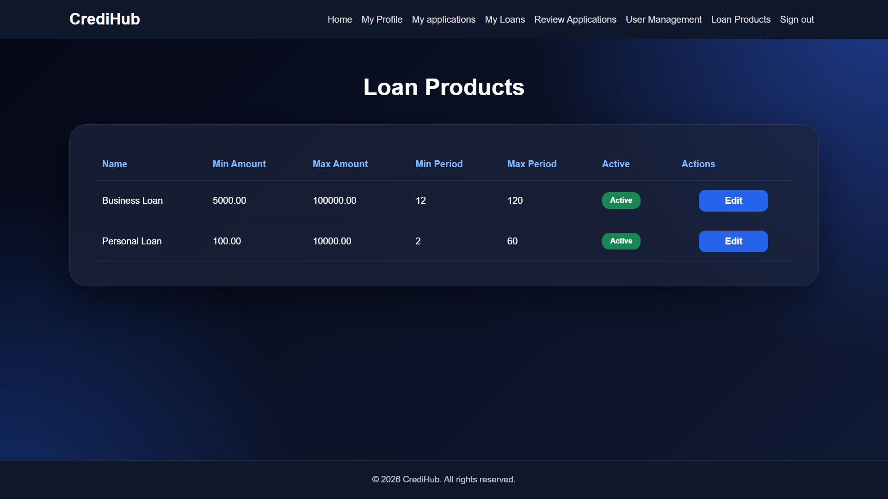

</details>

---

# ⚙️ Local Setup

## 1. Clone CrediHub

```bash

git clone https://github.com/elitsa7/credihub.git

cd credihub

```

## 2. Clone Payment Service

In another terminal:

```bash

git clone https://github.com/elitsa7/credihub-payment-service.git

cd credihub-payment-service

```

---

## 3. Configure Environment Variables

The local environment uses the `dev` profile.

The applications automatically create their required databases when they start.

### CrediHub

Configure:

```text

DB_PASSWORD

ADMIN_PASSWORD

```

Example:

```text

DB_PASSWORD=your-mysql-password

ADMIN_PASSWORD=your-admin-password

```

### Payment Service

Configure:

```text

DB_PASSWORD

```

Example:

```text

DB_PASSWORD=your-mysql-password

```

No Stripe configuration is required for local development.

---

## 4. Start Payment Service

The Payment Service runs on port `8081`.

```bash

cd credihub-payment-service

mvn clean install

mvn spring-boot:run

```

Payment Service:

```text

http://localhost:8081

```

---

## 5. Start CrediHub

The main CrediHub application runs on port `8080`.

```bash

cd credihub

mvn clean install

mvn spring-boot:run

```

CrediHub:

```text

http://localhost:8080

```

The applications should be running simultaneously:

```text

CrediHub

http://localhost:8080

        │

        │ OpenFeign

        ▼

Payment Service

http://localhost:8081

```

---

# 💳 Local Payment Testing

The `dev` profile uses:

```text

MockPaymentGateway

```

Therefore, local development does not require:

- A Stripe account

- Stripe API keys

- A Stripe webhook

- Stripe test cards

When a local installment is paid, the Payment Service completes the payment through the mock gateway and updates:

```text

Payment → SUCCESS

Installment → PAID

Loan balance → Updated

```

---

# 💳 Stripe Test Cards

The deployed application uses Stripe in test mode.

These Stripe test cards do not charge real money.

### Successful payment

```text

4242 4242 4242 4242

```

Expiry: any future date  

CVC: any 3 digits

### Declined payment

```text

4000 0000 0000 9995

```

### 3D Secure authentication

```text

4000 0025 0000 3155

```

> These cards apply when the deployed Stripe integration is running in Stripe test mode.

---

# ☁️ Azure Deployment

The live CrediHub application runs on **Microsoft Azure App Service**.

Deployment is automated using GitHub Actions.

The pipeline:

```text

Git Push

    │

    ▼

GitHub Actions

    │

    ├── Checkout

    ├── Setup Java 17

    ├── Maven Build

    ├── Package JAR

    └── Upload Artifact

            │

            ▼

      Azure App Service

```

---

# 📡 Payment Service API

The Payment Service exposes:

### Loan Accounts

```text

GET  /api/v1/loan-accounts/user/{userId}

POST /api/v1/loan-accounts

```

### Installments

```text

GET  /api/v1/installments/loan/{loanAccountId}

POST /api/v1/installments/{installmentId}/checkout

```

### Stripe Webhook

```text

POST /api/v1/payments/webhook

```

For complete microservice documentation:

https://github.com/elitsa7/credihub-payment-service

---

# 🔮 Future Improvements

Possible future improvements:

- Email notifications

- PDF loan contracts

- Advanced administration dashboards

- Payment history export

- Additional payment providers

- Two-factor authentication

- More detailed analytics

- Expanded reporting
  
---

# 👩‍💻 Author

**Elitsa Dacheva**

Java / Spring Boot Developer

---

<div align="center">

### 🚀 CrediHub

**Digital Loan Management with Spring Boot & Microservices**

</div>
